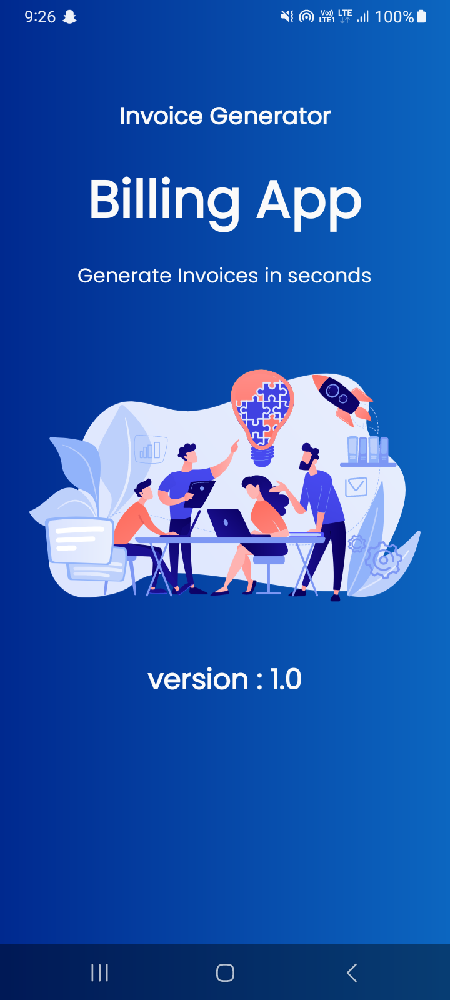
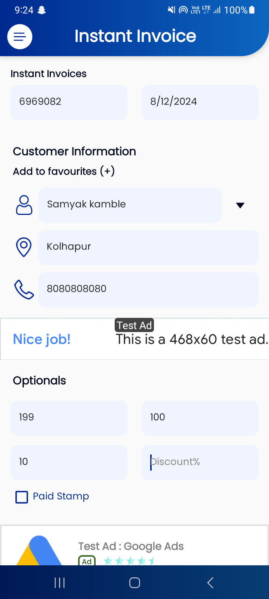
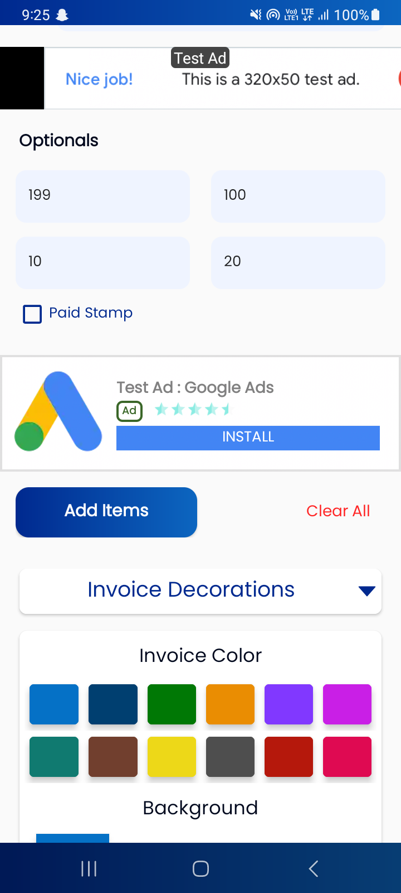
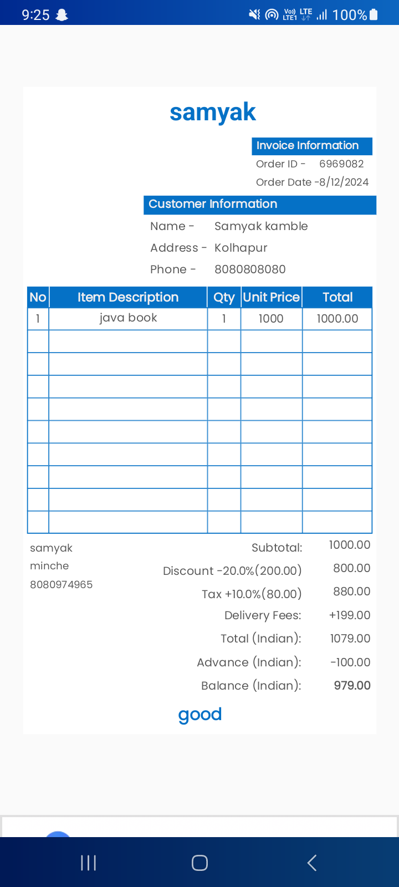

# 🧾 Invoice Generator

Welcome to the **Invoice Generator**! 🎉 This project simplifies invoice creation for businesses and freelancers alike. Whether you need to generate professional invoices in minutes or customize them for your specific needs, this tool has got you covered. 🚀

---

## 📝 Features

✅ **User-Friendly Interface**: Easily input details to generate invoices.  
✅ **Customizable Templates**: Modify templates to match your branding.  
✅ **Download and Print**: Save your invoices as PDFs or print directly.  
✅ **Multi-Currency Support**: Perfect for global transactions.  
✅ **Tax Calculations**: Automatically compute applicable taxes.  

---

## 📸 Visuals

Here's a sneak peek:  


| ## Screenshots                             |
|--------------------------------------------|
|      |
|      |
|      |
|      |

       
## 🔧 Installation

Follow these steps to set up the project:

1. Clone the repository:  
   ```bash
   git clone https://github.com/samyak2403/InvoiceGenerator.git
   ```
2. Navigate to the project directory:  
   ```bash
   cd InvoiceGenerator
   ```
3. Install dependencies:  
   ```bash
   npm install
   ```  
   *(Replace `npm` with your package manager, if different)*

4. Start the application:  
   ```bash
   npm start
   ```

---

## 🚀 Usage

1. Enter your business details and client information.  
2. Add items, quantities, and rates.  
3. Review the generated invoice.  
4. Download, print, or send directly via email! ✉️

---

## 🛠️ Roadmap

📌 **Upcoming Features**:  
- Integration with payment gateways.  
- Advanced analytics for invoices.  
- Multi-language support.  

Got ideas? [Contribute](#🤝-contributing) or open an issue!  

---

## 🤝 Contributing

We ❤️ contributions! Here's how you can help:

1. Fork the repository.  
2. Create a feature branch: `git checkout -b feature-name`.  
3. Commit your changes: `git commit -m 'Add a cool feature 🚀'`.  
4. Push to your branch: `git push origin feature-name`.  
5. Open a Pull Request. 🎉  

---

## 📜 License

This project is licensed under the [MIT License](LICENSE).  

---

## 📬 Support

Got questions or need help? Reach out:  
📧 Email: [samyak@example.com](mailto:samyak@example.com)  
🐞 Report bugs: [GitHub Issues](https://github.com/samyak2403/InvoiceGenerator/issues)  

---

## 🏗️ Project Status

🚧 Currently under active development! Stay tuned for updates.  
